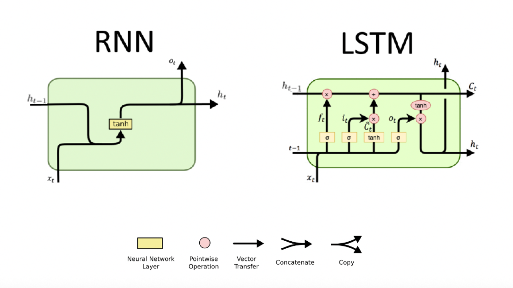

# Natural Language Processing with PyTorch

A collection of practical **Natural Language Processing (NLP)** projects implemented using **PyTorch**. This repository explores word embeddings, recurrent neural networks, language modeling, text generation, and sequence classification through hands-on implementations of Word2Vec, GloVe, RNNs, LSTMs, and generative language models. Each notebook has been reorganized, documented, and expanded to demonstrate practical deep learning workflows for NLP.

---

# 🚀 Repository Overview

This repository contains practical NLP projects built with **PyTorch**, covering distributed word representations, sequence modeling, sentiment analysis, text generation, and text classification using modern deep learning techniques.

<p align="center">
  
</p>

---

# ✨ Project Highlights

- Word Embeddings (Word2Vec & GloVe)
- Semantic Similarity & Word Analogies
- Bias in Word Embeddings
- Recurrent Neural Networks (RNNs)
- Long Short-Term Memory (LSTM) Networks
- Sentiment Analysis
- Character-Level Language Modeling
- Text Generation
- Sequence Modeling
- TorchText
- GPU-ready PyTorch implementations
- Well-documented notebooks suitable for learning and experimentation

---

# 📚 Topics Covered

- Natural Language Processing (NLP)
- Word Embeddings (Word2Vec & GloVe)
- Semantic Similarity
- Word Analogies
- Bias in Word Embeddings
- Recurrent Neural Networks (RNNs)
- Long Short-Term Memory (LSTMs)
- Sequence Modeling
- Character-Level Language Models
- Text Generation
- Sentiment Analysis
- Text Classification
- Teacher Forcing
- Variable-Length Sequences
- TorchText
- Deep Learning with PyTorch

---

# 🛠️ Technologies

- Python
- PyTorch
- TorchText
- Torchvision
- NumPy
- Matplotlib
- Scikit-learn

---

# 📂 Repository Structure

```text
natural-language-processing-pytorch/
│
├── README.md
├── requirements.txt
├── .gitignore
│
├── notebooks/
│   ├── 01_word-embeddings-and-rnn.ipynb
│   ├── 02_generative_rnn.ipynb
│   └── 03_spam_detection_lstm.ipynb
│
├── Images/
│   └── RNN_LSTM.jpg
│
└── models/
```

---

# 📖 Notebooks

## Notebook 1 — Word Embeddings and Recurrent Neural Networks

### Overview

This notebook introduces the foundations of Natural Language Processing using distributed word representations and recurrent neural networks. It begins by exploring **Word2Vec** and **GloVe** embeddings to understand semantic relationships between words, including similarity, analogies, and embedding bias. It then builds an end-to-end sentiment analysis pipeline by combining pretrained word embeddings with a recurrent neural network for tweet classification.

### Topics Covered

- Word2Vec
- GloVe embeddings
- Cosine similarity
- Semantic similarity
- Word analogies
- Bias in word embeddings
- Sentiment analysis
- Recurrent Neural Networks (RNNs)
- Variable-length sequences
- Tweet sentiment classification
- PyTorch implementation

### Notebook

`notebooks/01_word-embeddings-and-rnn.ipynb`

---

## Notebook 2 — Generative Recurrent Neural Networks

### Overview

This notebook extends recurrent neural networks to character-level language modeling and text generation. It demonstrates autoregressive sequence generation, teacher forcing during training, probability-based token sampling, and GPU-accelerated training for generative RNNs.

### Topics Covered

- Character-level language modeling
- Generative RNNs
- Text generation
- Teacher forcing
- Token sampling
- Hidden state propagation
- Sequence generation
- GPU training
- PyTorch implementation

### Notebook

`notebooks/02_generative_rnn.ipynb`

---

## Notebook 3 — SMS Spam Detection with LSTM Networks

### Overview

This notebook presents an end-to-end NLP project for SMS spam detection using Long Short-Term Memory (LSTM) networks. It covers text preprocessing, tokenization, TorchText pipelines, batching strategies, recurrent neural network training, and evaluation on a real-world text classification task.

### Topics Covered

- SMS spam detection
- Long Short-Term Memory (LSTM)
- Text preprocessing
- TorchText
- Word embeddings
- Sequence classification
- Model training and evaluation
- Deep learning with PyTorch

### Notebook

`notebooks/03_spam_detection_lstm.ipynb`

---

# 🎯 Learning Objectives

Throughout this repository, I explore how to:

- Learn distributed word representations using Word2Vec and GloVe embeddings.
- Analyze semantic similarity and solve word analogy tasks.
- Understand bias in pretrained word embeddings.
- Build recurrent neural networks for NLP applications.
- Process and batch variable-length text sequences.
- Generate text using character-level recurrent neural networks.
- Train LSTM models for text classification.
- Develop complete NLP workflows using PyTorch.

---

# 🚀 Getting Started

Clone the repository:

```bash
git clone https://github.com/Miladsaeedi70/natural-language-processing-pytorch.git
```

Navigate to the project:

```bash
cd natural-language-processing-pytorch
```

Install the required packages:

```bash
pip install -r requirements.txt
```

Launch Jupyter Notebook:

```bash
jupyter notebook
```

Open the notebooks in numerical order:

1. Word Embeddings and RNNs
2. Generative RNNs
3. SMS Spam Detection with LSTMs

---

# ⭐ About

This repository showcases practical Natural Language Processing projects implemented with PyTorch. Beginning with **word embeddings and recurrent neural networks for sentiment analysis**, it progresses to **character-level language modeling and text generation**, and concludes with a complete **LSTM-based SMS spam detection project**. The notebooks have been reorganized and modernized to improve readability, reproducibility, and compatibility with recent versions of PyTorch and Python.

---

# 📄 License

This repository is intended for educational and portfolio purposes.